# Testing Workflow Diagrams

**Purpose**: Visual reference for understanding ShowMIDI's testing infrastructure  
**Last Updated**: 2025-11-12

## Overview: Testing Triggers


## PR Validation Flow (ci.yml)

```mermaid
sequenceDiagram
    participant Dev as Developer
    participant GH as GitHub
    participant CL as config-loader
    participant CQ as code-quality
    participant Build as build jobs
    participant Test as test-suite
    participant Sum as test-summary
    
    Dev->>GH: Push to PR branch
    GH->>CL: Trigger ci.yml
    CL->>CL: Parse testing-governance.yaml
    CL->>CL: Extract timeouts, budgets
    CL-->>CQ: Output: unit_tests_timeout_sec
    
    CQ->>CQ: Install dependencies (Linux)
    CQ->>CQ: Check GPL headers
    CQ->>CQ: Configure & build (warnings as errors)
    CQ-->>Build: ✅ Code quality passed
    
    par Build all platforms
        Build->>Build: macOS build + test
        Build->>Build: Windows build
        Build->>Build: Linux build
    end
    
    Build-->>Test: ✅ Builds successful
    
    par Test all platforms (fail-fast)
        Test->>Test: macOS tests (primary)
        Test->>Test: Windows tests
        Test->>Test: Linux tests
    end
    
    Test->>Test: Generate test-run-summary.json
    Test-->>Sum: Upload artifacts
    
    Sum->>Sum: Download all test results
    Sum->>Sum: Parse CTest logs
    Sum->>Sum: Generate summary table
    Sum->>GH: Post PR comment
    Sum-->>Dev: 📊 Test results visible
```



## Nightly Validation Flow (nightly.yml)


## Platform Coverage Decision Tree


## Check Category Time Budgets


## Caching Strategy


## Test Artifact Flow


## Configuration-Driven Workflow

```mermaid
flowchart TD
    A[testing-governance.yaml] --> B[yq parser]
    B --> C{Extract values}
    
    C --> D[check_categories[].timeout_sec]
    C --> E[trigger_contexts[].time_budget_sec]
    C --> F[policies[].rules]
    
    D --> G[Set ctest --timeout]
    E --> H[Set job timeout-minutes]
    F --> I[Set retry/cache behavior]
    
    G --> J[CI job execution]
    H --> J
    I --> J
    
    J --> K{Job result}
    K -->|Success| L[Proceed to next job]
    K -->|Failure| M{Retry policy?}
    M -->|max_retries > 0| N[Retry with backoff]
    M -->|No retry| O[Fail job]
    
    N --> J
```

## Flake Detection (Planned - Phase 6)


## Legend

### Flow Shapes
- **Rectangle**: Process/Action
- **Diamond**: Decision point
- **Parallelogram**: Input/Output
- **Circle**: Start/End
- **Milestone**: Target/Checkpoint

### Colors (Mermaid themes)
- Green: Success path
- Red: Failure path
- Blue: Information/Data
- Yellow: Warning/Conditional

---

**Usage Tips**:
1. **For PRs**: Follow "PR Validation Flow" to understand why a check failed
2. **For Nightly**: Use "Nightly Validation Flow" to see what runs when
3. **For Timeouts**: Check "Check Category Time Budgets" to see if realistic
4. **For Caching**: Understand "Caching Strategy" to debug cache misses
5. **For Flakes**: Reference "Flake Detection" (when implemented) for quarantine logic
