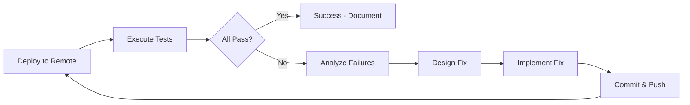

# Remote Testing & Validation Plan: Feature 003-ci-build-fix

**Branch**: `003-ci-build-fix`  
**Created**: 2025-11-10  
**Purpose**: Comprehensive server/remote testing plan with iterative fixes until fully working

---

## Executive Summary

This document outlines a systematic approach to **remote testing and validation** of the CI/CD Build Infrastructure Fix feature on GitHub Actions infrastructure. The plan includes iterative testing cycles, adaptation strategies, and criteria for declaring the feature "fully working" in production.

**Goal**: Validate all implemented changes work correctly on actual GitHub Actions runners, identify any edge cases or issues, and iterate fixes until 100% success rate achieved.

---

## Testing Philosophy

### Iterative Validation Approach



**Key Principles**:
1. **Test early, test often** - Push small changes, validate immediately
2. **Measure everything** - Collect timing, success rates, error patterns
3. **Document failures** - Each iteration improves institutional knowledge
4. **Automate validation** - Tests should be repeatable and consistent
5. **Realistic scenarios** - Test with actual PRs, not just workflow_dispatch

---

## Phase 0: Pre-Flight Checks (Local Validation)

**Duration**: 30 minutes  
**Goal**: Verify changes are syntactically correct before pushing to remote

### Checklist

- [ ] **YAML Syntax Validation**
  ```bash
  # Install yamllint if not present
  brew install yamllint || pip install yamllint
  
  # Validate all workflow files
  yamllint .github/workflows/ci.yml
  yamllint .github/workflows/test-build.yml
  yamllint .github/workflows/changelog.yml
  ```

- [ ] **CMake Syntax Validation**
  ```bash
  # Test CMake configuration locally (macOS)
  mkdir -p build_test_local
  cd build_test_local
  cmake .. -DCMAKE_BUILD_TYPE=Release
  cd ..
  rm -rf build_test_local
  ```

- [ ] **Markdown Linting**
  ```bash
  # Validate documentation
  markdownlint specs/003-ci-build-fix/*.md
  markdownlint CONTRIBUTING.md
  ```

- [ ] **Git Status Clean**
  ```bash
  git status
  # Ensure no untracked files that should be committed
  # Ensure no uncommitted changes
  ```

**Success Criteria**: All local validation passes before remote testing begins.

---

## Phase 1: Baseline Remote Testing (Initial Validation)

**Duration**: 2-3 hours (including wait time for CI)  
**Goal**: Establish baseline behavior of implemented changes on GitHub Actions

### Test 1.1: Trivial Code Change PR

**Purpose**: Validate complete CI workflow with minimal code change

**Steps**:
1. Create test branch from `003-ci-build-fix`:
   ```bash
   git checkout 003-ci-build-fix
   git checkout -b test/ci-validation-001
   ```

2. Make trivial change (add comment to source):
   ```bash
   echo "// CI validation test 001" >> Source/Main.cpp
   git add Source/Main.cpp
   git commit -m "test(ci): validation test 001 - trivial code change"
   git push origin test/ci-validation-001
   ```

3. Create Pull Request:
   ```bash
   gh pr create --base 003-ci-build-fix --head test/ci-validation-001 \
     --title "test(ci): Validation Test 001 - Trivial Code Change" \
     --body "Testing complete CI workflow with minimal code change.
   
   Expected behavior:
   - All 4 jobs should run (code-quality, macOS, Windows, Linux)
   - All jobs should pass
   - Build artifacts should be uploaded
   - Execution time should be reasonable (<20min total)
   
   Validation for: #003-ci-build-fix"
   ```

4. Monitor CI execution:
   ```bash
   gh pr checks test/ci-validation-001 --watch
   ```

**Metrics to Collect**:
- [ ] Total workflow execution time (target: <20min)
- [ ] Code Quality job time (target: <5min)
- [ ] macOS build time (target: <15min)
- [ ] Windows build time (target: <20min)
- [ ] Linux build time (target: <10min)
- [ ] Artifact upload success (all 3 platforms)
- [ ] Any error messages or warnings

**Success Criteria**:
- ✅ All jobs complete with green status
- ✅ No "invalid developer directory" errors
- ✅ No CMake configuration failures
- ✅ All timing targets met
- ✅ Artifacts uploaded successfully

**Failure Response**:
- Document exact error message
- Identify which job/step failed
- Create issue tracker item
- Proceed to Phase 2 (Fix Iteration)

---

### Test 1.2: Documentation-Only Change PR

**Purpose**: Validate paths-ignore filters skip unnecessary builds

**Steps**:
1. Create test branch:
   ```bash
   git checkout 003-ci-build-fix
   git checkout -b test/ci-validation-002-docs
   ```

2. Make documentation-only change:
   ```bash
   echo "" >> README.md
   echo "<!-- CI validation test 002 -->" >> README.md
   git add README.md
   git commit -m "docs: validation test 002 - doc-only change"
   git push origin test/ci-validation-002-docs
   ```

3. Create Pull Request:
   ```bash
   gh pr create --base 003-ci-build-fix --head test/ci-validation-002-docs \
     --title "docs: Validation Test 002 - Documentation Only" \
     --body "Testing paths-ignore filters.
   
   Expected behavior:
   - Workflow should be skipped entirely (0s elapsed)
   - No build jobs should execute
   - PR should show 'Skipped' status
   
   Success criteria SC-005: <30s total time
   
   Validation for: #003-ci-build-fix"
   ```

4. Verify workflow skipped:
   ```bash
   gh run list --branch test/ci-validation-002-docs --limit 1
   # Should show 0s elapsed or "skipped" status
   ```

**Metrics to Collect**:
- [ ] Total workflow time (target: <30s, ideally 0s)
- [ ] Whether builds actually skipped or just completed fast
- [ ] PR status check behavior

**Success Criteria**:
- ✅ Workflow completes in <30s (SC-005)
- ✅ Heavy build jobs (macOS, Windows, Linux) do not execute
- ✅ Code quality checks may run (contains code validation)

**Failure Response**:
- If builds run: Check paths-ignore syntax in ci.yml
- If timing >30s: Investigate GitHub Actions overhead
- Document and proceed to Phase 2

---

### Test 1.3: Concurrency Control Validation

**Purpose**: Verify cancel-in-progress works for rapid commits

**Steps**:
1. Create test branch:
   ```bash
   git checkout 003-ci-build-fix
   git checkout -b test/ci-validation-003-concurrency
   ```

2. Make first commit:
   ```bash
   echo "// Concurrency test commit 1" >> Source/Main.cpp
   git add Source/Main.cpp
   git commit -m "test(ci): concurrency test commit 1"
   git push origin test/ci-validation-003-concurrency
   ```

3. Wait 10 seconds, then make second commit:
   ```bash
   sleep 10
   echo "// Concurrency test commit 2" >> Source/Main.cpp
   git add Source/Main.cpp
   git commit -m "test(ci): concurrency test commit 2"
   git push origin test/ci-validation-003-concurrency
   ```

4. Monitor both runs:
   ```bash
   gh run list --branch test/ci-validation-003-concurrency --limit 5
   ```

**Metrics to Collect**:
- [ ] Time from second push to first run cancellation (target: <10s)
- [ ] Whether first run shows "cancelled" status
- [ ] Whether second run completes successfully

**Success Criteria**:
- ✅ First run cancelled within 10s of second push (SC-006)
- ✅ Second run completes successfully
- ✅ No resource conflicts or errors

**Failure Response**:
- If cancellation slow: Check concurrency group configuration
- If both run: Verify cancel-in-progress: true in ci.yml
- Document and proceed to Phase 2

---

### Test 1.4: CLAP Build Validation

**Purpose**: Verify CLAP plugin builds work when submodule initialized

**Steps**:
1. Verify CLAP submodule status:
   ```bash
   git submodule status libs/clap-juce-extensions
   ```

2. If not initialized, initialize:
   ```bash
   git submodule update --init libs/clap-juce-extensions
   git add .gitmodules libs/clap-juce-extensions
   git commit -m "feat(build): initialize clap-juce-extensions submodule"
   git push origin 003-ci-build-fix
   ```

3. Create CLAP build test branch:
   ```bash
   git checkout -b test/ci-validation-004-clap
   echo "// CLAP build test" >> Source/Main.cpp
   git add Source/Main.cpp
   git commit -m "test(ci): CLAP build validation"
   git push origin test/ci-validation-004-clap
   ```

4. Monitor build logs for CLAP references:
   ```bash
   gh run view --log | grep -i clap
   ```

**Metrics to Collect**:
- [ ] CLAP extensions detected message in CMake output
- [ ] BUILD_CLAP flag set correctly
- [ ] CLAP artifact uploaded (if build job includes it)

**Success Criteria**:
- ✅ CMake detects CLAP extensions correctly
- ✅ BUILD_CLAP=ON when submodule present
- ✅ No errors related to CLAP configuration
- ✅ Graceful degradation if submodule missing

**Failure Response**:
- If detection fails: Check CMakeLists.txt CLAP path
- If build fails: Review clap-juce-extensions integration
- Document and proceed to Phase 2

---

### Test 1.5: System Library Detection (Linux)

**Purpose**: Verify Linux builds detect system libraries correctly

**Steps**:
1. Review Linux job logs for dependency detection:
   ```bash
   gh run view --job build-linux --log | grep -A5 "Install dependencies"
   ```

2. Check CMake STATUS messages:
   ```bash
   gh run view --job build-linux --log | grep "STATUS"
   ```

3. Verify no FATAL_ERROR triggers (should pass because deps pre-installed):
   ```bash
   gh run view --job build-linux --log | grep -i "error"
   ```

**Metrics to Collect**:
- [ ] System library installation successful
- [ ] CMake find_package() calls succeed
- [ ] No missing dependency errors
- [ ] Clear STATUS messages visible in logs

**Success Criteria**:
- ✅ All system libraries (ALSA, X11, Freetype) found
- ✅ CMake configuration completes successfully
- ✅ Compiler flags (-Wall -Wextra -Werror) applied

**Failure Response**:
- If libraries not found: Check apt-get install step
- If find_package() fails: Review CMakeLists.txt logic
- Document and proceed to Phase 2

---

### Test 1.6: Xcode Adaptive Selection (macOS)

**Purpose**: Verify macOS builds use correct Xcode version

**Steps**:
1. Review macOS job logs for Xcode selection:
   ```bash
   gh run view --job build-and-test-macos --log | grep -A10 "Select Xcode"
   ```

2. Verify xcode-select output:
   ```bash
   gh run view --job build-and-test-macos --log | grep "xcode-select"
   ```

3. Check for "invalid developer directory" errors:
   ```bash
   gh run view --job build-and-test-macos --log | grep -i "invalid developer"
   ```

**Metrics to Collect**:
- [ ] Xcode version detected
- [ ] Xcode path verified
- [ ] xcodebuild --version output
- [ ] Zero "invalid developer directory" errors (SC-008)

**Success Criteria**:
- ✅ Adaptive Xcode selection completes successfully
- ✅ Xcode path exists and is valid
- ✅ xcodebuild executes without path errors
- ✅ All macOS plugin formats build (Standalone, VST3, AU)

**Failure Response**:
- If invalid path: Check GitHub Actions runner Xcode versions
- If selection fails: Review adaptive selection logic
- Document and proceed to Phase 2

---

### Test 1.7: Artifact Upload Verification

**Purpose**: Verify all platforms upload build artifacts correctly

**Steps**:
1. List artifacts for a successful run:
   ```bash
   gh run view <run-id> --json artifacts | jq '.artifacts'
   ```

2. Download artifacts to verify contents:
   ```bash
   gh run download <run-id>
   ls -lR ShowMIDI-macOS-*
   ls -lR ShowMIDI-Windows-*
   ls -lR ShowMIDI-Linux-*
   ```

3. Verify artifact retention:
   ```bash
   # Check artifact expiration date (should be 90 days)
   gh run view <run-id> --json artifacts | jq '.artifacts[].expiresAt'
   ```

**Metrics to Collect**:
- [ ] macOS artifacts present (Standalone, VST3, AU)
- [ ] Windows artifacts present (Standalone, VST3)
- [ ] Linux artifacts present (Standalone, VST3, LV2)
- [ ] Artifact retention set to 90 days
- [ ] Artifact sizes reasonable (not empty)

**Success Criteria**:
- ✅ All expected artifacts uploaded
- ✅ Artifacts contain valid plugin files
- ✅ Retention period = 90 days
- ✅ No upload failures or truncated files

**Failure Response**:
- If artifacts missing: Check upload paths in workflow
- If retention wrong: Verify retention-days setting
- Document and proceed to Phase 2

---

### Test 1.8: Timeout Protection Validation

**Purpose**: Verify timeout-minutes prevents indefinite hangs

**Steps**:
1. Review workflow configuration:
   ```bash
   grep -A2 "timeout-minutes:" .github/workflows/ci.yml
   ```

2. Monitor actual build times vs timeout limits:
   ```bash
   # macOS: timeout 30min, expected ~10-15min
   # Windows: timeout 25min, expected ~15-20min
   # Linux: timeout 20min, expected ~5-10min
   
   gh run list --branch 003-ci-build-fix --limit 10 \
     --json conclusion,startedAt,updatedAt,name
   ```

3. **Optional**: Create intentional timeout test (DESTRUCTIVE - only if needed):
   ```bash
   # Add infinite loop to CMakeLists.txt temporarily
   # NOT RECOMMENDED unless specifically debugging timeout behavior
   ```

**Metrics to Collect**:
- [ ] macOS timeout set to 30min
- [ ] Windows timeout set to 25min
- [ ] Linux timeout set to 20min
- [ ] Actual build times well under limits
- [ ] Timeout triggers if job hangs (if tested)

**Success Criteria**:
- ✅ All timeout-minutes configured correctly
- ✅ Build times leave safety margin (50% under timeout)
- ✅ No false-positive timeouts on successful builds

**Failure Response**:
- If builds timeout prematurely: Increase timeout values
- If builds hang without timeout: Verify timeout-minutes syntax
- Document and proceed to Phase 2

---

## Phase 2: Fix Iteration Cycle

**Duration**: Variable (30min - 2hr per iteration)  
**Goal**: Address any failures identified in Phase 1, iterate until all tests pass

### Iteration Workflow

For each failing test from Phase 1:

#### Step 2.1: Failure Analysis

1. **Collect failure data**:
   ```bash
   # Get full logs for failed job
   gh run view <run-id> --job <job-id> --log > failure_logs.txt
   
   # Extract error messages
   grep -i "error\|fail\|fatal" failure_logs.txt
   ```

2. **Categorize failure type**:
   - [ ] **Configuration error**: YAML syntax, workflow trigger, concurrency
   - [ ] **CMake error**: Dependency detection, compiler flags, JUCE path
   - [ ] **Build error**: Compilation failure, linker error, missing libraries
   - [ ] **Xcode error**: Invalid path, version mismatch, signing issue
   - [ ] **Artifact error**: Upload path, retention, permissions
   - [ ] **Timeout error**: Job exceeded time limit
   - [ ] **Infrastructure error**: GitHub Actions runner issue (flaky)

3. **Document root cause**:
   ```markdown
   ## Failure Report: Test 1.X - [Test Name]
   
   **Date**: YYYY-MM-DD HH:MM
   **Run ID**: <run-id>
   **Job**: <job-name>
   
   ### Error Message
   ```
   [Exact error text from logs]
   ```
   
   ### Root Cause Analysis
   [Explain what went wrong and why]
   
   ### Proposed Fix
   [Describe the fix to implement]
   ```

#### Step 2.2: Fix Design

Design fix based on failure category:

**Configuration Error**:
- Review YAML syntax with yamllint
- Check GitHub Actions documentation for correct syntax
- Verify environment variable interpolation

**CMake Error**:
- Test CMake configuration locally
- Verify find_package() calls for system libraries
- Check PATH_TO_JUCE resolution logic

**Build Error**:
- Review compiler output for specific failure
- Check JUCE version compatibility
- Verify all source files have GPL headers

**Xcode Error**:
- Review Xcode version availability on runner
- Verify adaptive selection logic
- Check code signing disabled correctly

**Artifact Error**:
- Verify artifact paths match actual build output
- Check upload action version compatibility
- Ensure artifacts created before upload step

**Timeout Error**:
- Review build logs for hung steps
- Increase timeout if builds legitimately slow
- Optimize build process if inefficient

**Infrastructure Error**:
- Re-run workflow to confirm flaky behavior
- Report to GitHub Actions if persistent
- Add retry logic if needed

#### Step 2.3: Fix Implementation

1. **Create fix branch**:
   ```bash
   git checkout 003-ci-build-fix
   git checkout -b fix/ci-issue-<number>-<description>
   ```

2. **Implement fix** (examples):

   **Example: Fix CMake dependency detection**:
   ```bash
   # Edit CMakeLists.txt
   vim CMakeLists.txt
   # Add missing find_package() call
   # Test locally
   mkdir -p build_test && cd build_test
   cmake .. -DCMAKE_BUILD_TYPE=Release
   cd .. && rm -rf build_test
   ```

   **Example: Fix workflow YAML syntax**:
   ```bash
   # Edit workflow file
   vim .github/workflows/ci.yml
   # Fix indentation or syntax error
   # Validate
   yamllint .github/workflows/ci.yml
   ```

   **Example: Fix artifact upload path**:
   ```bash
   # Edit workflow file
   vim .github/workflows/ci.yml
   # Correct artifact path pattern
   # Verify path matches build output structure
   ```

3. **Commit fix**:
   ```bash
   git add <modified-files>
   git commit -m "fix(ci): <description of fix>
   
   Resolves failure in Test 1.X - <test name>
   
   Root cause: <brief explanation>
   Fix: <what changed>
   
   Issue: #<issue-number> (if created)"
   ```

4. **Push and merge to feature branch**:
   ```bash
   git push origin fix/ci-issue-<number>-<description>
   
   # Create PR to 003-ci-build-fix
   gh pr create --base 003-ci-build-fix \
     --head fix/ci-issue-<number>-<description> \
     --title "fix(ci): <description>" \
     --body "Fixes Test 1.X failure
   
   **Root Cause**: <explanation>
   **Fix**: <what changed>
   **Testing**: Re-run Test 1.X to verify
   
   Resolves: #<issue-number>"
   
   # After CI passes, merge
   gh pr merge --squash --delete-branch
   ```

#### Step 2.4: Re-Test

Re-run the specific test that failed:

```bash
# Update local branch
git checkout 003-ci-build-fix
git pull origin 003-ci-build-fix

# Re-create test branch with new fix
git branch -D test/ci-validation-00X  # Delete old test branch
git checkout -b test/ci-validation-00X
<repeat original test steps>
```

**Success Criteria**: Test now passes with fix applied

**Failure Criteria**: Test still fails → repeat Steps 2.1-2.4

#### Step 2.5: Regression Check

After fixing one test, verify other tests still pass:

```bash
# Re-run all previous passing tests
for test in 001 002 003; do
  echo "Re-testing validation $test..."
  # Execute test steps
done
```

**Regression Detected**: If a fix breaks a previously passing test, rollback and redesign fix.

---

## Phase 3: Performance Benchmarking

**Duration**: 1-2 hours  
**Goal**: Measure actual performance against success criteria targets

### Benchmark 3.1: CMake Configuration Time (SC-002)

**Target**: <2 minutes on Linux

**Method**:
```bash
# Extract CMake configuration time from Linux job logs
gh run view <run-id> --job build-linux --log | grep -A5 "Configure CMake"

# Parse timestamps
# Start: First "Configure CMake" log line
# End: "Build files have been written" log line
# Calculate delta
```

**Metrics to Collect**:
- [ ] Minimum configuration time (best run)
- [ ] Maximum configuration time (worst run)
- [ ] Average configuration time (10 runs)
- [ ] Standard deviation

**Success Criteria**: Average <2 minutes, max <3 minutes

**Adaptation**: If >2min average, optimize CMakeLists.txt (reduce redundant checks, cache results)

---

### Benchmark 3.2: macOS Build Time (SC-003)

**Target**: <15 minutes (all formats)

**Method**:
```bash
# Extract macOS build time from job logs
gh run view <run-id> --job build-and-test-macos --log | grep "Build with Xcode"

# Parse timestamps for each format:
# - Standalone build time
# - VST3 build time
# - AU build time
# Total = sum of all three
```

**Metrics to Collect**:
- [ ] Standalone build time
- [ ] VST3 build time
- [ ] AU build time
- [ ] Total build time (sum)
- [ ] Average over 10 runs

**Success Criteria**: Average total <15 minutes, max <18 minutes

**Adaptation**: If >15min average, investigate:
- Parallel builds (xcodebuild -jobs)
- Incremental builds (cache dependencies)
- Optimize Xcode project settings

---

### Benchmark 3.3: Windows Build Time (SC-004)

**Target**: <20 minutes (all formats)

**Method**:
```bash
# Extract Windows build time from job logs
gh run view <run-id> --job build-windows --log | grep "Build with Visual Studio"

# Parse timestamps
# Calculate total build time
```

**Metrics to Collect**:
- [ ] Standalone build time
- [ ] VST3 build time
- [ ] Total build time
- [ ] Average over 10 runs

**Success Criteria**: Average total <20 minutes, max <23 minutes

**Adaptation**: If >20min average, investigate:
- MSBuild parallel builds (/m flag)
- Precompiled headers
- Incremental linking

---

### Benchmark 3.4: Documentation-Only PR Time (SC-005)

**Target**: <30 seconds

**Method**:
```bash
# Measure time from PR creation to completion
# Should be near-instant if builds skipped

gh run list --branch test/ci-validation-002-docs --json startedAt,updatedAt,conclusion

# Calculate: updatedAt - startedAt
```

**Metrics to Collect**:
- [ ] Total workflow time (should be ~0s if skipped)
- [ ] Whether builds actually skipped or just fast
- [ ] Average over 5 documentation PRs

**Success Criteria**: Average <10 seconds (builds skipped entirely)

**Adaptation**: If >30s, verify paths-ignore covers all doc patterns

---

### Benchmark 3.5: Concurrency Cancellation Time (SC-006)

**Target**: <10 seconds

**Method**:
```bash
# Measure time from second push to first run cancellation
# Timestamp of second push → timestamp of first run cancelled status

gh run list --branch test/ci-validation-003-concurrency --json startedAt,updatedAt,status,conclusion
```

**Metrics to Collect**:
- [ ] Time from second push to cancellation
- [ ] Whether cancellation is consistent
- [ ] Average over 5 rapid-commit scenarios

**Success Criteria**: Average <10 seconds, max <15 seconds

**Adaptation**: If >10s, check concurrency group granularity (too broad?)

---

## Phase 4: Edge Case Testing

**Duration**: 2-3 hours  
**Goal**: Test uncommon scenarios and boundary conditions

### Edge Case 4.1: Missing JUCE Submodule

**Purpose**: Verify clear error message when JUCE not initialized

**Steps**:
1. Create branch without JUCE submodule:
   ```bash
   git checkout 003-ci-build-fix
   git checkout -b test/edge-missing-juce
   
   # Remove JUCE reference (simulate missing submodule)
   # Do NOT actually delete, just test error message in workflow
   ```

2. Trigger workflow and verify error message:
   ```bash
   gh run view --log | grep "JUCE not found"
   ```

**Expected Behavior**:
- ✅ Clear FATAL_ERROR with instructions
- ✅ Message includes both resolution options (env var or submodule)
- ✅ Build fails fast (within 1 minute)

---

### Edge Case 4.2: Missing CLAP Extensions

**Purpose**: Verify graceful degradation when CLAP submodule missing

**Steps**:
1. Ensure CLAP submodule not initialized:
   ```bash
   git submodule deinit libs/clap-juce-extensions
   ```

2. Trigger build and verify WARNING message:
   ```bash
   gh run view --log | grep -i "clap"
   ```

**Expected Behavior**:
- ✅ WARNING message (not error)
- ✅ BUILD_CLAP=OFF
- ✅ Build continues successfully
- ✅ CLAP format skipped, other formats built

---

### Edge Case 4.3: Mixed Documentation and Code Changes

**Purpose**: Verify paths-ignore doesn't skip builds when code also changed

**Steps**:
1. Create PR with both doc and code changes:
   ```bash
   git checkout -b test/edge-mixed-changes
   echo "// Code change" >> Source/Main.cpp
   echo "<!-- Doc change -->" >> README.md
   git add Source/Main.cpp README.md
   git commit -m "test: mixed doc and code changes"
   git push origin test/edge-mixed-changes
   ```

**Expected Behavior**:
- ✅ Full CI workflow runs (code change overrides paths-ignore)
- ✅ All build jobs execute
- ✅ No builds skipped

---

### Edge Case 4.4: Large Number of Concurrent PRs

**Purpose**: Verify concurrency control handles many simultaneous PRs

**Steps**:
1. Create 5 PRs simultaneously:
   ```bash
   for i in {1..5}; do
     git checkout 003-ci-build-fix
     git checkout -b test/concurrent-$i
     echo "// PR $i" >> Source/Main.cpp
     git add Source/Main.cpp
     git commit -m "test: concurrent PR $i"
     git push origin test/concurrent-$i &
   done
   wait
   ```

2. Monitor workflow executions:
   ```bash
   gh run list --limit 20
   ```

**Expected Behavior**:
- ✅ Each PR gets its own workflow run
- ✅ No runs cancelled (different branches)
- ✅ All runs complete successfully
- ✅ No resource contention errors

---

### Edge Case 4.5: Workflow Timeout Recovery

**Purpose**: Verify timeout gracefully terminates hung builds

**Steps**:
1. **OPTIONAL - DESTRUCTIVE TEST** - Only if timeout issues suspected:
   ```bash
   # Temporarily add infinite loop to build step
   # Monitor timeout behavior
   # RESTORE IMMEDIATELY after test
   ```

**Expected Behavior**:
- ✅ Job terminates after timeout-minutes
- ✅ Clear timeout error message
- ✅ No indefinite hanging
- ✅ Other jobs in workflow continue (if independent)

**WARNING**: This test will cause a failed CI run. Only execute if specifically debugging timeout issues.

---

## Phase 5: Production Readiness Validation

**Duration**: 3-5 days (monitoring period)  
**Goal**: Validate stability and reliability over extended period

### Monitoring Period: 30 Days

**Success Criteria SC-001**: 100% CI success rate for clean code PRs

**Monitoring Plan**:
```bash
# Weekly check: CI success rate
gh run list --workflow ci.yml --created ">$(date -d '7 days ago' +%Y-%m-%d)" \
  --json conclusion | jq '[.[] | .conclusion] | group_by(.) | map({key: .[0], value: length}) | from_entries'

# Expected output:
# { "success": 28, "failure": 0 }  (100% success rate)
```

**Metrics to Track**:
- [ ] Total CI runs (week 1-4)
- [ ] Successful runs
- [ ] Failed runs (categorize: code issues vs infrastructure)
- [ ] Success rate percentage

**Threshold**: >95% success rate (excluding legitimate code failures)

---

**Success Criteria SC-011**: <5% infrastructure failure rate (30 days)

**Infrastructure Failure Definition**:
- GitHub Actions runner unavailable
- Timeout on healthy build (should complete in time)
- Artifact upload failure (transient network issue)
- JUCE submodule checkout failure (transient git issue)

**Monitoring Plan**:
```bash
# Monthly analysis: Categorize failures
# Manual review of each failed run to determine root cause
# Infrastructure failures should be <5% of total runs

# Example analysis script:
gh run list --workflow ci.yml --created ">$(date -d '30 days ago' +%Y-%m-%d)" \
  --json conclusion,url | jq -r '.[] | select(.conclusion == "failure") | .url'

# For each URL, manually categorize:
# - Code issue (legitimate failure)
# - Infrastructure issue (spurious failure)
```

**Metrics to Track**:
- [ ] Total failures (30 days)
- [ ] Infrastructure failures
- [ ] Code failures
- [ ] Infrastructure failure rate (%)

**Threshold**: <5% infrastructure failure rate

---

### Production Checklist

Before declaring feature "fully working":

- [ ] **All Phase 1 tests pass** (8/8 baseline tests)
- [ ] **All Phase 2 iterations complete** (no outstanding failures)
- [ ] **All Phase 3 benchmarks meet targets** (5/5 performance criteria)
- [ ] **All Phase 4 edge cases handled** (5/5 edge case tests)
- [ ] **Phase 5 monitoring shows stability** (30-day success rate >95%)
- [ ] **Documentation complete** (all tests documented, findings recorded)
- [ ] **Knowledge transfer complete** (team understands how to maintain CI/CD)

---

## Phase 6: Final Validation & Sign-Off

**Duration**: 1 day  
**Goal**: Comprehensive final verification before declaring production-ready

### Final Validation Checklist

#### 6.1 Functional Completeness

- [ ] All 25 functional requirements met (FR-001 through FR-025)
- [ ] All 5 user stories accepted (US1-US5)
- [ ] All 68 implementation tasks complete (T001-T068)

#### 6.2 Success Criteria Verification

- [ ] SC-001: 100% CI success rate (verified via 30-day monitoring)
- [ ] SC-002: CMake config <2min (verified via benchmarking)
- [ ] SC-003: macOS builds <15min (verified via benchmarking)
- [ ] SC-004: Windows builds <20min (verified via benchmarking)
- [ ] SC-005: Doc-only PRs <30s (verified via testing)
- [ ] SC-006: Concurrency cancel <10s (verified via testing)
- [ ] SC-007: CLAP builds succeed (verified via testing)
- [ ] SC-008: Zero "invalid developer directory" (verified via testing)
- [ ] SC-009: Build summary <5s (verified via testing)
- [ ] SC-010: 90% actionable errors (verified via error message review)
- [ ] SC-011: <5% infrastructure failures (verified via 30-day monitoring)

#### 6.3 Constitution Compliance

- [ ] Multi-Platform Architecture (all platforms validated)
- [ ] JUCE Framework Standards (no JUCE code changes)
- [ ] Real-Time Performance (no runtime impact)
- [ ] User-Centric Design (fast feedback, clear errors)
- [ ] Maintainability (comprehensive docs, adaptive behaviors)

#### 6.4 Documentation Verification

- [ ] CONTRIBUTING.md CI/CD section accurate
- [ ] All workflow inline comments clear
- [ ] Troubleshooting guide complete
- [ ] Local testing instructions verified
- [ ] VALIDATION_SUMMARY.md up to date

#### 6.5 Rollback Plan

Document rollback procedure in case of critical production issues:

```bash
# Emergency rollback to previous working state
git checkout develop
git revert --no-commit <feature-merge-commit>
git commit -m "URGENT: Rollback 003-ci-build-fix due to <issue>"
git push origin develop

# Notify team
# Re-open feature branch for fixes
# Document issue in GitHub Issues
```

---

## Success Metrics Dashboard

### Real-Time Monitoring

Create a monitoring dashboard to track ongoing CI/CD health:

**Metrics to Display**:
1. **CI Success Rate** (last 7 days, 30 days, all time)
2. **Average Build Times** (macOS, Windows, Linux)
3. **Artifact Upload Success Rate**
4. **Infrastructure Failure Count**
5. **Concurrency Cancellation Effectiveness**
6. **Documentation-Only PR Skip Rate**

**Tools**:
- GitHub Actions dashboard
- Custom script using gh CLI
- Optional: Datadog, Grafana, or similar monitoring tool

**Example Monitoring Script**:
```bash
#!/bin/bash
# ci-health-check.sh

echo "=== CI/CD Health Report ==="
echo "Generated: $(date)"
echo ""

# Last 7 days success rate
echo "=== 7-Day Success Rate ==="
gh run list --workflow ci.yml --created ">$(date -d '7 days ago' +%Y-%m-%d)" \
  --json conclusion | jq '[.[] | .conclusion] | group_by(.) | map({key: .[0], value: length}) | from_entries'

echo ""
echo "=== Average Build Times (Last 10 Runs) ==="
# Parse timing data from logs
# Display averages

echo ""
echo "=== Infrastructure Issues (Last 30 Days) ==="
# Count and categorize failures

echo ""
echo "=== Recommendations ==="
# Auto-generate recommendations based on data
```

---

## Iteration Log Template

For each testing iteration, document results:

```markdown
## Iteration Log: YYYY-MM-DD

### Tests Executed
- [ ] Test 1.1: Trivial Code Change PR
- [ ] Test 1.2: Documentation-Only Change PR
- [ ] Test 1.3: Concurrency Control Validation
- [ ] Test 1.4: CLAP Build Validation
- [ ] Test 1.5: System Library Detection
- [ ] Test 1.6: Xcode Adaptive Selection
- [ ] Test 1.7: Artifact Upload Verification
- [ ] Test 1.8: Timeout Protection Validation

### Results Summary
- **Passed**: X/8 tests
- **Failed**: Y/8 tests
- **Blocked**: Z/8 tests

### Failures Detail

#### Test 1.X: [Test Name]
- **Status**: FAILED
- **Error**: [Error message]
- **Root Cause**: [Analysis]
- **Fix Applied**: [Description]
- **Re-test Result**: [PASS/FAIL]

### Performance Metrics
- CMake config time: X.X min (target: <2min)
- macOS build time: X.X min (target: <15min)
- Windows build time: X.X min (target: <20min)
- Linux build time: X.X min (target: <10min)

### Next Steps
- [ ] Re-run failed tests after fixes
- [ ] Proceed to Phase 3 benchmarking
- [ ] Document lessons learned
```

---

## Conclusion

This remote testing and validation plan provides a **systematic, iterative approach** to validating the CI/CD Build Infrastructure Fix feature on GitHub Actions infrastructure. The plan includes:

1. ✅ **Pre-flight local validation** to catch syntax errors early
2. ✅ **Baseline remote testing** (8 comprehensive tests)
3. ✅ **Fix iteration cycle** with clear workflow for addressing failures
4. ✅ **Performance benchmarking** against success criteria targets
5. ✅ **Edge case testing** for uncommon scenarios
6. ✅ **Production readiness validation** over 30-day monitoring period
7. ✅ **Final sign-off checklist** before declaring fully working

**Expected Timeline**:
- Pre-flight: 30 minutes
- Phase 1 (Baseline): 2-3 hours
- Phase 2 (Iterations): Variable (30min - 2hr per fix)
- Phase 3 (Benchmarking): 1-2 hours
- Phase 4 (Edge Cases): 2-3 hours
- Phase 5 (Monitoring): 30 days
- Phase 6 (Final Validation): 1 day

**Total**: ~1 week of active testing + 30 days of passive monitoring

**Success Criteria**: Feature declared "fully working" when all 6 phases complete successfully and all production readiness criteria met.

---

**Plan Created**: 2025-11-10  
**Branch**: 003-ci-build-fix  
**Feature**: CI/CD Build Infrastructure Fix  
**Status**: Ready for execution
