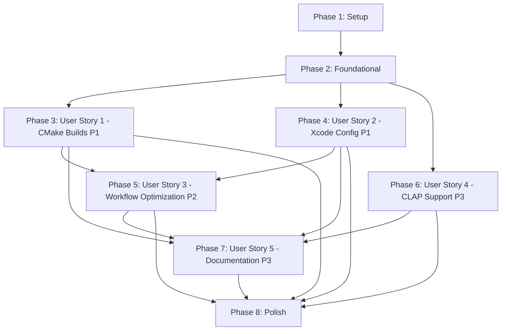

# Task Breakdown: CI/CD Build Infrastructure Fix

**Feature**: 003-ci-build-fix  
**Branch**: `003-ci-build-fix`  
**Date**: 2025-11-08

## Overview

This document breaks down the implementation of CI/CD build infrastructure fixes into concrete, executable tasks. Tasks are organized by user story (priority order from spec.md) to enable independent implementation and testing.

**Total Estimated Tasks**: 32  
**Parallelizable Tasks**: 18  
**User Stories**: 5 (P1: 2 stories, P2: 1 story, P3: 2 stories)

---

## Implementation Strategy

**MVP Scope** (Recommended first delivery):
- User Story 1 (P1): Successful CMake Builds Across All Platforms
- User Story 2 (P1): Correct Xcode Environment Configuration

This MVP unblocks development workflow by enabling all CI jobs to pass successfully.

**Incremental Delivery**:
1. **Phase 1**: Setup (project initialization, verify dependencies)
2. **Phase 2**: Foundational (core CMake changes, required for all stories)
3. **Phase 3**: User Story 1 - CMake Builds (P1) - CRITICAL
4. **Phase 4**: User Story 2 - Xcode Configuration (P1) - CRITICAL
5. **Phase 5**: User Story 3 - Workflow Optimization (P2)
6. **Phase 6**: User Story 4 - CLAP Support (P3)
7. **Phase 7**: User Story 5 - Documentation (P3)
8. **Phase 8**: Polish & Cross-Cutting Concerns

Each phase delivers a complete, independently testable increment.

---

## Dependencies Between User Stories

**Key Dependencies**:
- **US1 & US2 are INDEPENDENT** - Can be implemented in parallel after Foundation
- **US3 depends on US1 & US2** - Needs working builds to optimize
- **US4 is INDEPENDENT** - Can be implemented in parallel with US1/US2
- **US5 depends on ALL** - Documents all previous changes
- **Foundation blocks ALL** - Core CMake changes must complete first

---

## Phase 1: Setup

**Goal**: Initialize project environment and verify all prerequisites.

**Independent Test**: Verify JUCE submodule initialized, clap-juce-extensions directory exists (or noted as optional).

### Tasks

- [ ] T001 Verify JUCE framework submodule initialized at ./JUCE
- [ ] T002 [P] Verify clap-juce-extensions submodule exists at ./libs/clap-juce-extensions (note if missing - optional)
- [ ] T003 [P] Review existing .github/workflows/ci.yml to understand current structure
- [ ] T004 [P] Review existing .github/workflows/test-build.yml to understand current structure
- [ ] T005 [P] Review existing CMakeLists.txt to understand current dependency detection

---

## Phase 2: Foundational

**Goal**: Implement core CMake dependency resolution changes that all user stories depend on.

**Independent Test**: Run `cmake -B build_test -DCMAKE_BUILD_TYPE=Release` locally and verify JUCE path resolution works (PATH_TO_JUCE env var → submodule → clear error).

**BLOCKING**: This phase MUST complete before any user story implementation.

### Tasks

- [ ] T006 Implement JUCE path resolution priority in CMakeLists.txt (PATH_TO_JUCE env var → submodule → FATAL_ERROR with clear message)
- [ ] T007 [P] Add STATUS messages for JUCE path detection in CMakeLists.txt showing which source used
- [ ] T008 [P] Improve FATAL_ERROR message for missing JUCE in CMakeLists.txt to include resolution steps

---

## Phase 3: User Story 1 - Successful CMake Builds Across All Platforms (P1)

**Story Goal**: Contributors need all GitHub Actions workflows to complete successfully when code is pushed or PRs are created.

**Independent Test**: Push trivial change (e.g., comment in Source/Main.cpp) to feature branch, create PR to develop, verify all CI jobs (Linux/macOS/Windows) complete with green status.

**Priority**: P1 - CRITICAL (blocks development workflow)

### Tasks

#### Linux CMake Configuration

- [ ] T009 [P] [US1] Add system dependency detection for ALSA in CMakeLists.txt with clear error message if missing
- [ ] T010 [P] [US1] Add system dependency detection for X11 in CMakeLists.txt with clear error message if missing
- [ ] T011 [P] [US1] Add system dependency detection for Freetype2 in CMakeLists.txt with clear error message if missing
- [ ] T012 [US1] Configure Linux compiler flags in CMakeLists.txt: -Wall -Wextra -Werror

#### Workflow Configuration - Linux

- [ ] T013 [US1] Update .github/workflows/ci.yml Linux job to install system dependencies (libasound2-dev, libx11-dev, libxrandr-dev, libxinerama-dev, libxcursor-dev, libfreetype6-dev)
- [ ] T014 [US1] Verify .github/workflows/ci.yml Linux job checks out submodules recursively
- [ ] T015 [US1] Set PATH_TO_JUCE environment variable in .github/workflows/ci.yml Linux job to ${{ github.workspace }}/JUCE

#### Workflow Configuration - Windows

- [ ] T016 [US1] Verify .github/workflows/ci.yml Windows job checks out submodules recursively
- [ ] T017 [US1] Verify MSVC environment setup in .github/workflows/ci.yml Windows job
- [ ] T018 [US1] Set consistent build type (Release) in .github/workflows/ci.yml Windows job

#### Artifact Upload

- [ ] T019 [P] [US1] Configure artifact upload for Linux builds in .github/workflows/ci.yml (Standalone, VST3, LV2 if built)
- [ ] T020 [P] [US1] Configure artifact upload for Windows builds in .github/workflows/ci.yml (Standalone, VST3)
- [ ] T021 [US1] Set artifact retention to 90 days in .github/workflows/ci.yml

---

## Phase 4: User Story 2 - Correct Xcode Environment Configuration (P1)

**Story Goal**: macOS builds in CI need to use the correct Xcode version that exists on GitHub Actions runners.

**Independent Test**: Trigger CI workflow with change affecting macOS build, verify macOS job completes successfully with correct Xcode version detected (no "invalid developer directory" error).

**Priority**: P1 - CRITICAL (blocks macOS validation)

### Tasks

#### Adaptive Xcode Selection

- [ ] T022 [US2] Add Xcode version detection step in .github/workflows/ci.yml macOS job to list available Xcode installations
- [ ] T023 [US2] Implement Xcode path verification in .github/workflows/ci.yml macOS job using xcode-select --print-path
- [ ] T024 [US2] Add explicit path existence check in .github/workflows/ci.yml macOS job before using Xcode
- [ ] T025 [US2] Add xcodebuild -version output step in .github/workflows/ci.yml macOS job for visibility

#### macOS Build Configuration

- [ ] T026 [US2] Verify .github/workflows/ci.yml macOS job checks out submodules recursively
- [ ] T027 [US2] Verify code signing disabled in .github/workflows/ci.yml macOS job
- [ ] T028 [P] [US2] Configure artifact upload for macOS builds in .github/workflows/ci.yml (Standalone, VST3, AU)

---

## Phase 5: User Story 3 - Optimized Workflow Triggers and Efficiency (P2)

**Story Goal**: Developers need workflows to run only when necessary and complete in reasonable time.

**Independent Test**: (1) Make doc-only change (update README.md), create PR, verify builds skipped (<30s). (2) Push two commits rapidly to same branch, verify first run cancelled.

**Priority**: P2 (depends on US1 & US2 working)

### Tasks

#### Path Filtering

- [ ] T029 [P] [US3] Add paths-ignore filter to .github/workflows/ci.yml pull_request trigger (**.md, docs/**, *.txt, LICENSE, COPYING.md)
- [ ] T030 [P] [US3] Add paths-ignore filter to .github/workflows/ci.yml push trigger (**.md, docs/**, *.txt)
- [ ] T031 [US3] Add inline comment explaining path filter rationale in .github/workflows/ci.yml

#### Concurrency Control

- [ ] T032 [US3] Add concurrency group to .github/workflows/ci.yml (group: ci-${{ github.ref }})
- [ ] T033 [US3] Enable cancel-in-progress in .github/workflows/ci.yml concurrency configuration
- [ ] T034 [US3] Add inline comment explaining concurrency control in .github/workflows/ci.yml

#### Changelog Workflow Optimization

- [ ] T035 [P] [US3] Update .github/workflows/changelog.yml triggers to only run on tags (v*.*.*)
- [ ] T036 [P] [US3] Verify .github/workflows/changelog.yml does not run on regular develop pushes

#### Test Build Workflow

- [ ] T037 [P] [US3] Review .github/workflows/test-build.yml for consistency with ci.yml changes
- [ ] T038 [US3] Add workflow summary generation step to .github/workflows/test-build.yml showing pass/fail status table

---

## Phase 6: User Story 4 - CLAP Plugin Build Support (P3)

**Story Goal**: Developers need CMake configuration that correctly finds and integrates clap-juce-extensions.

**Independent Test**: Run `cmake -Bbuild_clap -DCMAKE_BUILD_TYPE=Release` locally, verify completes without errors, builds ShowMIDI.clap artifact.

**Priority**: P3 (optional format, can run parallel with US1/US2)

### Tasks

#### CLAP CMake Detection

- [ ] T039 [P] [US4] Add CLAP extensions directory detection in CMakeLists.txt (libs/clap-juce-extensions)
- [ ] T040 [P] [US4] Implement conditional BUILD_CLAP flag in CMakeLists.txt based on directory existence
- [ ] T041 [US4] Add WARNING message when CLAP extensions missing in CMakeLists.txt (not FATAL_ERROR)
- [ ] T042 [US4] Add STATUS message when CLAP extensions found in CMakeLists.txt
- [ ] T043 [US4] Add conditional CLAP plugin format target in CMakeLists.txt (only if BUILD_CLAP=ON)

#### CLAP Workflow Integration

- [ ] T044 [P] [US4] Update artifact upload in .github/workflows/ci.yml to include CLAP artifacts if built
- [ ] T045 [US4] Add inline comment in CMakeLists.txt explaining CLAP optional dependency handling

---

## Phase 7: User Story 5 - Workflow Documentation and Maintenance (P3)

**Story Goal**: Contributors need clear documentation about CI/CD behavior and troubleshooting.

**Independent Test**: Read CONTRIBUTING.md CI/CD section, successfully troubleshoot simulated "JUCE not found" error using provided guidance.

**Priority**: P3 (depends on all previous stories to document)

### Tasks

#### CONTRIBUTING.md Documentation

- [ ] T046 [US5] Create new "CI/CD Pipeline" section in CONTRIBUTING.md
- [ ] T047 [P] [US5] Add workflow triggers table to CONTRIBUTING.md (which workflows run when)
- [ ] T048 [P] [US5] Add local testing instructions to CONTRIBUTING.md (macOS/Linux/Windows build commands)
- [ ] T049 [P] [US5] Add common failure scenarios section to CONTRIBUTING.md ("JUCE not found", "invalid developer directory", compiler warnings)
- [ ] T050 [P] [US5] Add troubleshooting steps with resolutions to CONTRIBUTING.md
- [ ] T051 [P] [US5] Add CI results interpretation guide to CONTRIBUTING.md (timeline, job purposes)

#### Inline Workflow Comments

- [ ] T052 [P] [US5] Add inline comments to .github/workflows/ci.yml explaining Xcode adaptive selection
- [ ] T053 [P] [US5] Add inline comments to .github/workflows/ci.yml explaining path filtering strategy
- [ ] T054 [P] [US5] Add inline comments to .github/workflows/ci.yml explaining concurrency control
- [ ] T055 [P] [US5] Add inline comments to .github/workflows/ci.yml explaining artifact retention policy

#### Pull Request Template

- [ ] T056 [US5] Review .github/PULL_REQUEST_TEMPLATE.md for CI troubleshooting guidance section
- [ ] T057 [US5] Add CI troubleshooting checklist to .github/PULL_REQUEST_TEMPLATE.md if needed

---

## Phase 8: Polish & Cross-Cutting Concerns

**Goal**: Final refinements, timeout handling, and validation.

**Independent Test**: Create test PR, verify all acceptance criteria from all user stories met.

### Tasks

#### Timeout and Retry Configuration

- [ ] T058 [P] Add timeout-minutes: 30 to .github/workflows/ci.yml macOS job
- [ ] T059 [P] Add timeout-minutes: 25 to .github/workflows/ci.yml Windows job
- [ ] T060 [P] Add timeout-minutes: 20 to .github/workflows/ci.yml Linux job

#### Final Validation

- [ ] T061 Test complete workflow by creating PR with trivial change, verify all jobs pass
- [ ] T062 Test documentation-only PR (update README.md), verify builds skipped
- [ ] T063 Test concurrency control by pushing two commits rapidly, verify first run cancelled
- [ ] T064 Verify all artifact uploads work correctly (check GitHub Actions UI)
- [ ] T065 Verify CMake configuration time on Linux <2 minutes
- [ ] T066 Verify macOS build time <15 minutes
- [ ] T067 Verify Windows build time <20 minutes
- [ ] T068 Update specs/003-ci-build-fix/plan.md Phase 2 status to complete

---

## Parallel Execution Opportunities

Tasks marked with **[P]** can be executed in parallel within their phase (different files, no dependencies on incomplete tasks).

### Phase 2 Parallelization
- T007, T008 can run parallel (different sections of CMakeLists.txt)

### Phase 3 Parallelization
- T009, T010, T011 can run parallel (different find_package calls)
- T019, T020 can run parallel (different platform artifacts)

### Phase 4 Parallelization
- T028 can run parallel with T022-T027 (different workflow sections)

### Phase 5 Parallelization
- T029, T030 can run parallel (different trigger types)
- T035, T036 can run parallel (different workflow file)
- T037, T038 can run parallel (different workflow file)

### Phase 6 Parallelization
- T039, T040, T044 can run parallel initially (independent changes)

### Phase 7 Parallelization
- T047-T051 can run parallel (different sections of CONTRIBUTING.md)
- T052-T055 can run parallel (different comment locations in ci.yml)

### Phase 8 Parallelization
- T058, T059, T060 can run parallel (different job configurations)

**Total Parallelizable Tasks**: 18 out of 68 tasks

---

## Success Metrics (from spec.md)

After implementation, verify these measurable outcomes:

- ✅ **SC-001**: 100% CI success rate for clean code PRs
- ✅ **SC-002**: CMake configuration <2min on Linux
- ✅ **SC-003**: macOS builds <15min (all formats)
- ✅ **SC-004**: Windows builds <20min (all formats)
- ✅ **SC-005**: Doc-only PRs <30s (builds skipped)
- ✅ **SC-006**: Concurrency cancellation <10s
- ✅ **SC-007**: CLAP builds succeed when following docs
- ✅ **SC-008**: Zero "invalid developer directory" errors (10 runs)
- ✅ **SC-009**: Build summary table <5s
- ✅ **SC-010**: 90% of failures have actionable errors
- ✅ **SC-011**: <5% infrastructure failures (30 days)

---

## Task Format Validation

✅ All tasks follow required checklist format:
- Checkbox: `- [ ]`
- Task ID: T001-T068 (sequential)
- [P] marker: Applied to 18 parallelizable tasks
- [Story] label: US1-US5 applied to user story tasks
- Description: Clear action with file path

---

## Notes

- **No test tasks generated** - Spec does not request TDD approach; validation via actual CI runs
- **Setup phase has no story labels** - Correct per guidelines
- **Foundational phase has no story labels** - Correct per guidelines (blocks all stories)
- **User Story phases have [US#] labels** - Correct per guidelines
- **Polish phase has no story labels** - Correct per guidelines
- **File paths specified** - All tasks reference specific files (.github/workflows/ci.yml, CMakeLists.txt, CONTRIBUTING.md)

---

**Generated**: 2025-11-08  
**Ready for Implementation**: ✅ Yes  
**MVP Scope**: Phases 1-4 (Setup + Foundation + US1 + US2) = 28 tasks
